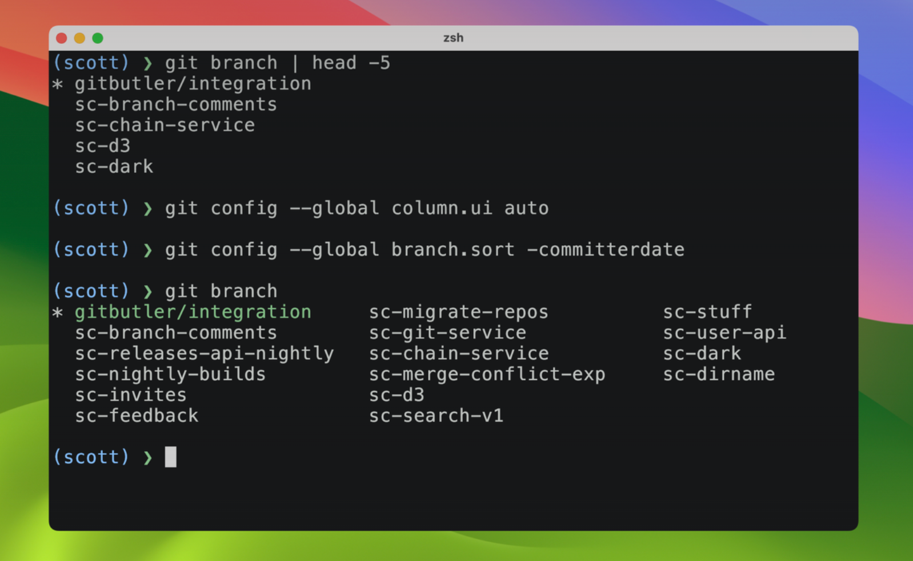
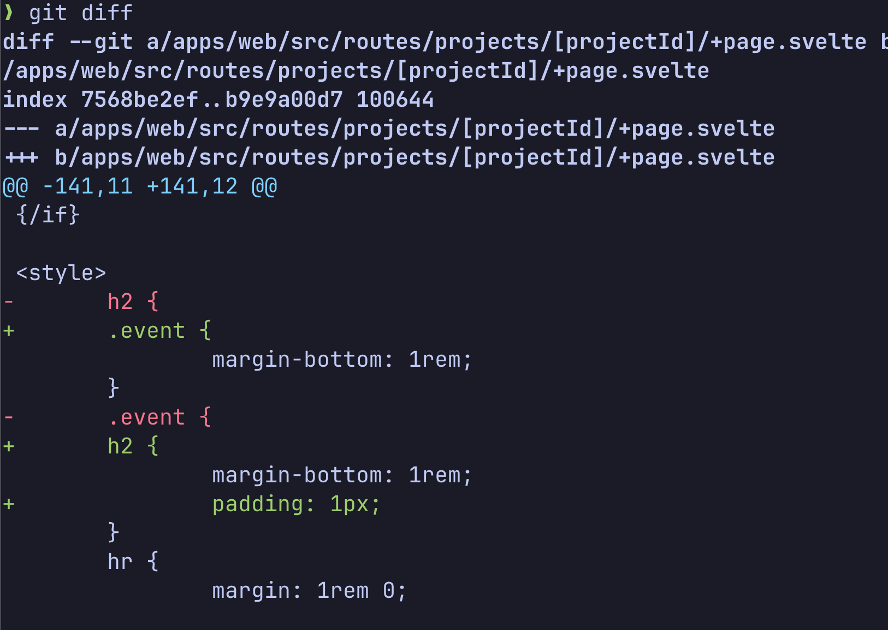
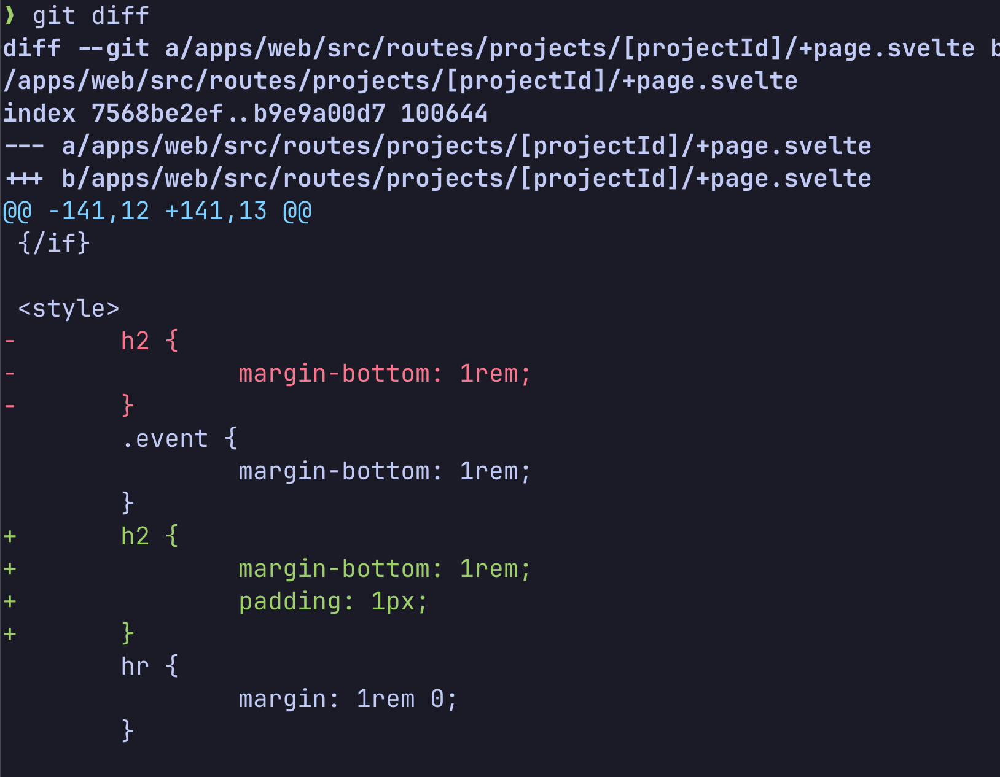
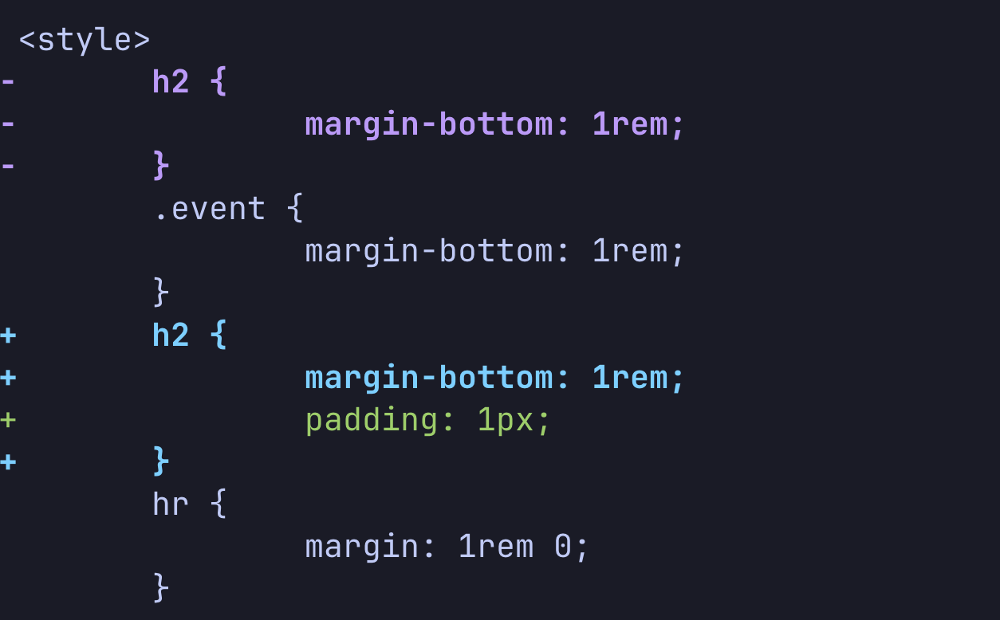
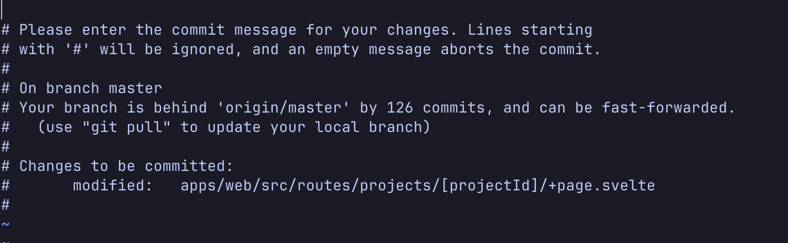
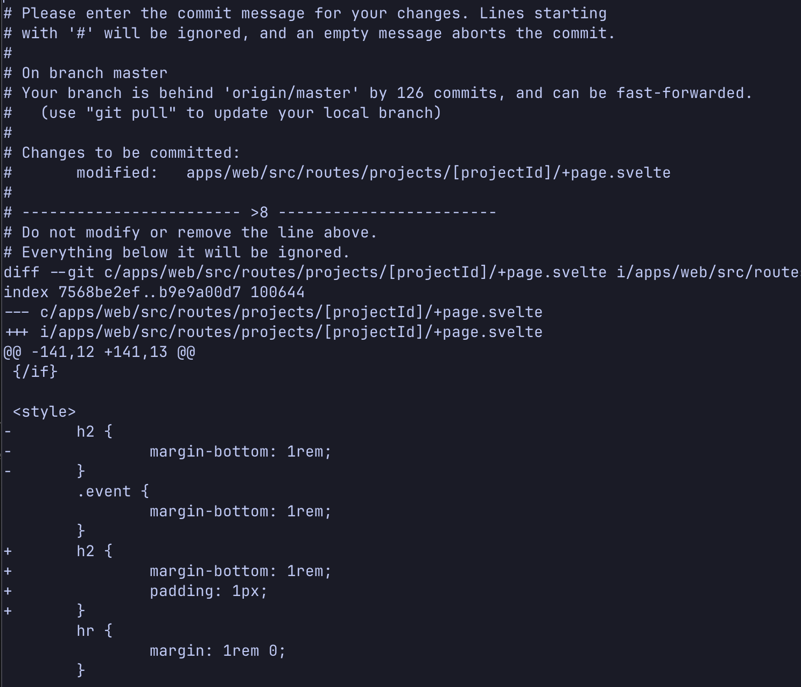
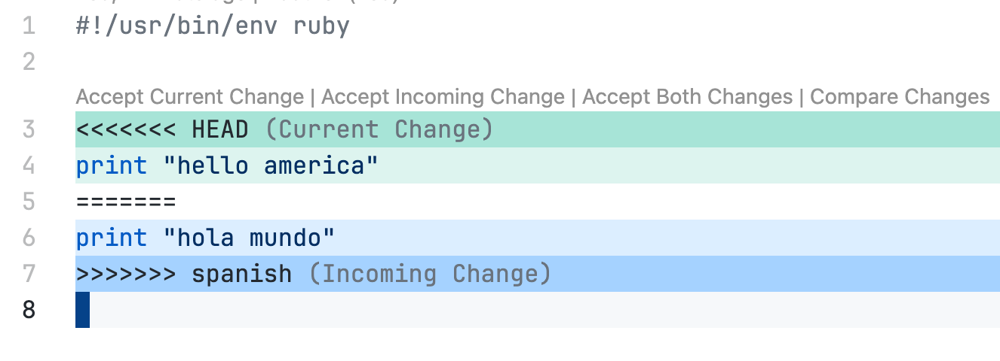
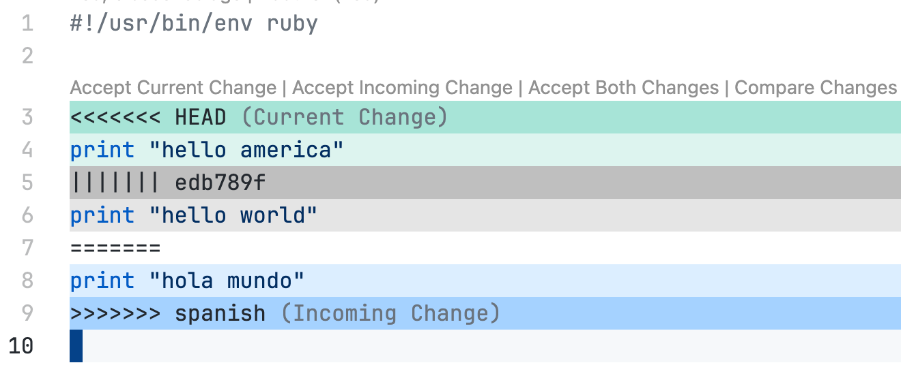


Este blog post é uma tradução livre de [How Core Git Developers Configure Git](https://blog.gitbutler.com/how-git-core-devs-configure-git/) do autor [Scott Chacon](https://github.com/schacon).



Há algumas semanas, eu [escrevi sobre](https://blog.gitbutler.com/why-is-git-autocorrect-too-fast-for-formula-one-drivers/) a configuração `help.autocorrect` do Git e a estranha história sobre a origem do seu valor em decisegundos.

Isso me fez pensar em outras configurações do `git config` que a maioria das pessoas provavelmente não conhece e que, provavelmente, deveriam ter valores padrão diferentes.

Neste post, vou abordar algumas das configurações do Git — talvez obscuras — que pessoalmente habilitei globalmente e explicar o que elas fazem e por que *provavelmente* deveriam ser os valores padrão.

Além disso, descobri que aprendi a maioria dessas configurações com as pessoas que realmente trabalham no código-fonte central do Git todos os dias.

### TL;DR

Primeiro, porém, alguns de vocês podem não se importar particularmente com a maravilhosa e sórdida história dos valores do `rerere` ou algo assim. Talvez vocês só estejam pensando “apenas me deem as configurações para que eu possa jogá-las cegamente no meu arquivo `~/.gitconfig`."

Tudo bem. Aqui estão as configurações:

```ini
# claramente faz do git um lugar melhor

[column]
        ui = auto
[branch]
        sort = -committerdate
[tag]
        sort = version:refname
[init]
        defaultBranch = main
[diff]
        algorithm = histogram
        colorMoved = plain
        mnemonicPrefix = true
        renames = true
[push]
        default = simple
        autoSetupRemote = true
        followTags = true
[fetch]
        prune = true
        pruneTags = true
        all = true

# porque diabos não tentar?

[help]
        autocorrect = prompt
[commit]
        verbose = true
[rerere]
        enabled = true
        autoupdate = true
[core]
        excludesfile = ~/.gitignore
[rebase]
        autoSquash = true
        autoStash = true
        updateRefs = true

# uma questão de gosto (tire os comentarios se você tiver coragem)

[core]
        # fsmonitor = true
        # untrackedCache = true
[merge]
        # (just 'diff3' if git version < 2.3)
        # conflictstyle = zdiff3 
[pull]
        # rebase = true
```

Copiem e colem, meus amigos.

### Como os Desenvolvedores Centrais do Git Configuram o Git?

Antes de entrar em cada uma delas, há uma questão interessante: será que até mesmo os desenvolvedores centrais do Git acham que alguns desses valores padrão deveriam ser alterados?

Isso surgiu há não muito tempo na lista de discussão do Git e, honestamente, algumas dessas configurações eu aprendi pessoalmente a partir [deste tópico](https://lore.kernel.org/git/60b5d281552d6_e359f20828@natae.notmuch/?ref=blog.gitbutler.com) chamado "Spring Cleaning", onde Felipe Contreras desafiou a equipe central do Git a remover todas as opções e aliases acumulados na configuração e ver como era usar o Git "puro", logo de fábrica.

Ele desafiou a lista a prestar atenção em quais configurações eles realmente queriam mudar e compartilhar com o grupo as principais mudanças de configuração que, aparentemente, deveriam ser os novos padrões. 

Os [resultados](https://lore.kernel.org/git/60df97ed24687_34a92088a@natae.notmuch/?ref=blog.gitbutler.com) foram bastante interessantes: uma lista concisa de 9 configurações e 3 aliases que os participantes do experimento concordaram, mais ou menos, que poderiam ser os novos padrões. Vamos dar uma olhada nas mudanças propostas.

```ini
merge.conflictstyle = zdiff3
rebase.autosquash = true
rebase.autostash = true 
commit.verbose = true
diff.colorMoved = true
diff.algorithm = histogram
grep.patternType = perl
feature.experimental = true
branch.sort = committerdate
```

Agora, *nenhuma* dessas se tornou o novo padrão nos 3 ou 4 anos desde o experimento, mas é interessante que muitos dos desenvolvedores do Git têm dificuldade em usar o Git sem várias dessas configurações ativadas.

Ainda mais interessante é que *a maioria de vocês* provavelmente não sabe o que *qualquer* uma dessas configurações faz.

Então, vamos explorá-las. O que elas fazem e por que você quase certamente pode confiar cegamente em mim e habilitá-las?

Vou agrupar essas configurações em três categorias:

- [Melhora Claramente o Git](#melhora-claramente-o-git)
- [Por Que Não?](#por-que-não)
- [Uma Questão de Gosto](#uma-questão-de-gosto)

Vamos começar.

## Melhora Claramente o Git

Este primeiro grupo de configurações *claramente* melhora o Git por padrão. Geralmente, não há desvantagens em habilitá-las.

### Listando branches

Eu mencionei isso em um post anterior sobre Dicas do Git, na seção “[Coisas de Branch](https://blog.gitbutler.com/git-tips-2-new-stuff-in-git/#some-git-branch-stuff)”, mas como isso também estava na lista do Spring Cleaning, acho que todos concordam que listar os branches do Git provavelmente não deveria ser em ordem alfabética por padrão.

As duas configurações que ajudam nisso são `branch.sort` e `column.ui`. A primeira ordena a lista pela data do commit mais recente (provavelmente deixando os mais interessantes no topo) em vez da ordem alfabética. A segunda coloca os nomes dos branches em formato de coluna, permitindo ver mais por tela.

```bash
git config --global column.ui auto
git config --global branch.sort -committerdate
```

A configuração `column.ui` também afeta a saída de outros comandos de listagem (clean, status, tag), mas, de maneira geral, acho que é melhor que o padrão.



Você também pode ordenar por outros critérios além da data do commit, mas acho que este é claramente o mais útil.

### Listando tags

Falando em listar coisas, é absurdo que esta não seja a configuração padrão para listar tags, já que é o que quase todo mundo realmente quer.

Normalmente, se você listar tags em ordem alfabética, obterá algo como:

```bash
$ git tag
nightly/0.5.100
nightly/0.5.1000
nightly/0.5.1001
nightly/0.5.101
nightly/0.5.1010
```

Ninguém quer que `0.5.101` venha depois de `0.5.1000`, mas essa é a ordem alfabética. Você pode corrigir isso configurando:

```bash
git config --global tag.sort version:refname
```

Isso fará exatamente o que você espera, tratando números de versão separados por pontos como uma série de valores inteiros para fins de ordenação. Confie em mim, apenas ative essa configuração.

### Branch padrão

Esta configuração pode ser um pouco mais controversa, já que pode ser considerada um pouco política, mas deveria haver um nome de branch padrão no Git para que ele não reclame toda vez que você `init` um novo repositório.

```bash
git config --global init.defaultBranch main
```

Pessoalmente, não tenho problema com `master` e a maioria dos meus repositórios usam esse nome, já que era o padrão, mas também estou de acordo com `main`, então use o que você preferir.

O que acho realmente irritante é que o Git agora é insistente sobre isso, em vez de simplesmente atualizar o valor padrão. Eu gostaria que o Git tivesse um pouco de bom senso, mas não tem, então configure com o nome que você achar razoável. Mas tanto faz.

### Melhor diff

Na verdade, poderia haver um post inteiro sobre os algoritmos de `git diff`, mas a versão resumida é que, por padrão, o Git usa um algoritmo de diff antigo, rápido e bastante confiável chamado "myers diff".

Para dar uma ideia do que "antigo" significa, ele foi publicado pela primeira vez em um artigo em 1986, ou seja, tem quase 40 anos. Se você é da minha idade, talvez eu possa dar uma perspectiva dos meus tempos de infância: os filmes *Os Três Amigos*, *Uma História Americana* e o primeiro *Highlander* estrearam nos cinemas naquele ano.

Enfim, avanços foram feitos desde então (com alguns compromissos) e pode surpreender você saber que o Git vem com 4 algoritmos de diff embutidos que podem ser usados: [`myers`](#), `minimal`, [``patience``](https://blog.jcoglan.com/2017/09/19/the-patience-diff-algorithm/?utm_source=chatgpt.com) e `histogram`.

Quase certamente, o que você quer usar é o algoritmo `histogram` (uma melhoria incremental sobre o `patience`), em vez do padrão `myers`. Você pode alterar isso globalmente assim:

```bash
git config --global diff.algorithm histogram
```

Aqui está um exemplo de uma simples movimentação de código, diferenciada com `myers` versus `histogram`, para dar uma ideia de como o algoritmo pode ser um pouco mais inteligente:

Suponha que movamos uma classe CSS para abaixo de outra similar, mudemos um pouco e, em seguida, rodemos `git diff` com o algoritmo padrão `myers`. Podemos obter algo assim:



Ok, um pouco confuso. Aqui está o que o `histogram` nos daria no mesmo cenário:



Fica um pouco mais claro o que aconteceu.

Até recentemente, no ano passado, o Elijah (famoso pelo [Git Merge](https://www.youtube.com/watch?v=KXPmiKfNlZE&ref=blog.gitbutler.com)) sugeriu que  
[histogram ou patience](https://lore.kernel.org/git/CABPp-BEmgOAj17DozyXNaf-9CawDic4uTpMbckef3+zHf7URqQ@mail.gmail.com/?ref=blog.gitbutler.com) poderiam ser melhores padrões, além da sugestão do Felipe no Spring Cleaning, mas, na realidade, é improvável que isso seja adotado tão cedo.

Isso é importante, mas há também algumas pequenas alterações adicionais que você pode fazer no `git diff`:

```bash
git config --global diff.colorMoved plain
git config --global diff.mnemonicPrefix true
git config --global diff.renames true
```

A opção `colorMoved` também estava na lista do Spring Cleaning, então provavelmente deveria ser o padrão.

Aqui está um exemplo da movimentação de código anterior com o `colorMoved` ativado:



Você pode ver a diferença entre o código movido e a linha adicionada. Com o `colorMoved`, a movimentação de código aparece em cores diferentes das linhas adicionadas e removidas.

A opção `diff.renames` detecta se um arquivo foi renomeado — o que geralmente é bom (ainda que um pouco mais custoso) — e o `diff.mnemonicPrefix` substitui os `a/` e `b/` do cabeçalho do diff por indicações de onde o diff está vindo, como `i/` (index), `w/` (diretório de trabalho) ou `c/` (commit).

Assim, se eu fizer um diff de uma alteração do index para o diretório de trabalho, obtenho um cabeçalho de diff como este:

```diff
❯ git diff
diff --git i/apps/web/page.js w/apps/web/page.js
index 7568be2ef..b9e9a00d7 100644
--- i/apps/web/page.js
+++ w/apps/web/page.js
```

Pode ficar um pouco difícil de ver neste exemplo, mas você consegue perceber, pelos nomes dos caminhos, de qual lado vem cada parte — do index ou do diretório de trabalho. É sutil, mas eu gosto.

### Melhor envio (push)

Uma das coisas que sempre me confundiu e frustrou desde os primórdios do Git é a configuração dos branches de acompanhamento. Quando faço um push, para onde ele envia ou ele nem envia?

Existem três configurações de push que acredito proporcionar uma experiência padrão muito melhor. A primeira (`push.default simple`) é o padrão desde o Git 2.0, mas as outras ainda precisam ser configuradas explicitamente.

```bash
git config --global push.default simple # (padrão desde a versão 2.0)
git config --global push.autoSetupRemote true
git config --global push.followTags true
```

Isso sempre foi um incômodo no Git. O novo padrão `simple` é desenvolvido, mais ou menos, para fluxos de trabalho centralizados e, por padrão, envia o branch atual com o mesmo nome no remoto. Acho que é um padrão bem sensato.

Entretanto, se esse branch não existir e não houver um branch de acompanhamento configurado, você ainda verá este erro:

```bash
$ git push
fatal: The current branch my-branch-name has no upstream branch.
To push the current branch and set the remote as upstream, use

    git push --set-upstream origin my-branch-name
```

Imagino que todos vocês já tenham visto isso *um milhão* de vezes.

Se você configurar `push.autoSetupRemote` como true, esse erro não ocorrerá mais. Se o branch de acompanhamento não estiver definido, ele será automaticamente configurado. Não consigo nem dizer o quanto amo essa configuração.

Por fim, a configuração `push.followTags` enviará todas as tags que você tem localmente e que não estão no servidor, toda vez que você fizer um push. Já fui pego de surpresa por isso algumas vezes — se você criar tags localmente, configure isso para não se preocupar que os outros não as vejam.

### Melhor fetch

Pode-se argumentar que é bom manter algumas cópias locais históricas de branches e tags que já estiveram no servidor mas não estão mais, mas eu realmente não acredito nisso.

Pessoalmente, acho que o comportamento padrão do Git deveria ser deixar suas referências remotas o mais próximas possível do que está no servidor. Remover o que foi deletado, etc.

Então, acho que essas configurações de fetch deveriam ser o padrão:

```bash
git config --global fetch.prune true
git config --global fetch.pruneTags true
git config --global fetch.all true
```

Essencialmente, isso garante que deletamos `origin/blah` se `blah` for removido no servidor, e também faz isso automaticamente para todos os remotos que temos configurados. Parece bem razoável.

## Por Que Não?

Este próximo grupo de configurações é, em geral, inofensivo e, ocasionalmente, útil.

Não tenho certeza se mudaria os padrões, mas também não acho que prejudicaria ninguém e, em muitos casos, pode ser mais útil, por isso estou incluindo-as na lista.

### Autocorreção com Prompt

Como expliquei detalhadamente no meu [post anterior](https://blog.gitbutler.com/why-is-git-autocorrect-too-fast-for-formula-one-drivers/), o Git possui um recurso interessante em que, se seus dedos errarem ao digitar um comando, ele tenta adivinhar o que você quis dizer e executa o comando.

O padrão é não fazer nada. O que eu prefiro é que ele adivinhe e pergunte se está certo.

```bash
git config --global help.autocorrect prompt
```

Se quiser ler mais sobre essa configuração, sua justificativa e sua história de forma detalhada, eu tenho [um post para você](https://blog.gitbutler.com/why-is-git-autocorrect-too-fast-for-formula-one-drivers/).

### Commit com Diff

Esta também foi uma das sugestões da lista do Spring Cleaning, creio que principalmente porque adiciona mais contexto à hora de escrever a mensagem de commit no seu editor.

Por padrão, um `git commit` mostra uma mensagem parecida com esta:



Onde aparece apenas uma lista dos arquivos modificados. Se você configurar `commit.verbose` como true, ele incluirá a saída completa do `diff` para você consultar enquanto escreve sua mensagem.

```bash
git config --global commit.verbose true
```

Veja como fica quando você vai fazer o commit:



Tudo isso será removido da mensagem de commit (tudo abaixo daquela hilária linha de "tesoura" `-- >8 --`), mas pode fornecer mais contexto para a sua mensagem.

### Reutilizar Resoluções Gravadas

Essa configuração é útil somente se você estiver fazendo rebase com conflitos repetidamente. Não é uma situação comum, mas não há problema em tê-la ativada mesmo que nunca seja usada.

```bash
git config --global rerere.enabled true
git config --global rerere.autoupdate true
```

A opção `enabled` garante que o Git registre os estados antes e depois dos conflitos durante o rebase, e a `autoupdate` re-aplica automaticamente as resoluções se encontrar o mesmo conflito novamente. Eu já escrevi sobre isso [aqui](https://blog.gitbutler.com/git-tips-1-theres-a-git-config-for-that/#reuse-recorded-resolution), então não vou me alongar mais.

### Arquivo de Ignore Global

Isto pode parecer bobo, mas, já que existe um arquivo `~/.gitconfig` com configurações globais, seria legal ter um arquivo `~/.gitignore` com padrões globais também. Essa configuração permite isso:

```bash
git config --global core.excludesfile ~/.gitignore
```

Na verdade, isso é meio desnecessário, pois o Git já procura valores globais de ignore em dois lugares: `~/git/ignore` e `~/.config/git/ignore`. Mas, como esses caminhos são um pouco obscuros, acho bacana ter esse caminho mais intuitivo.

### Rebase um Pouco Melhor

Esta seção se relaciona ao caso de uso em que você está corrigindo e juntando seus commits. Se você não sabe o que isso significa, confira nosso post anterior sobre [autosquashing](https://blog.gitbutler.com/git-autosquash/).

Contudo, se você faz squash e rebase com frequência (ou mesmo ocasionalmente), essas configurações podem ajudar sem causar problemas.

```bash
git config --global rebase.autoSquash true
git config --global rebase.autoStash true
git config --global rebase.updateRefs true
```

A configuração `updateRefs` deveria quase certamente ser o padrão, pois garante que referências empilhadas em um branch sejam movidas junto quando o branch é rebaseado.

Se quiser aprender um pouco mais sobre como usar fixup, autosquash e updateRefs, o mais fácil é assistir a alguns minutos de uma palestra que explico [aqui](https://www.youtube.com/embed/Md44rcw13k4?start=810&feature=oembed).

## Uma Questão de Gosto

O próximo grupo é baseado em sua preferência pessoal, mas a maioria das pessoas nem sabe que essas configurações existem, e muitas podem achá-las úteis. Elas estão comentadas nas configurações do resumo.

### Melhores Conflitos de Merge

Embora esse tópico tenha sido levantado no Spring Cleaning como algo que poderia ser o novo padrão, não tenho certeza se todos concordariam.

Quando você tem um conflito de merge no Git, em vez de inserir apenas os marcadores de conflito das duas versões, você pode configurar o Git para incluir também a base comum do arquivo. Às vezes, isso pode ser muito útil, mas para alguns pode ser irritante.

```bash
git config --global merge.conflictstyle zdiff3
```

Houve discussões na lista do Git para tornar isso o padrão e, na verdade, o GitButler usa a estratégia `diff3` para os marcadores de conflito, mas, para ser sincero, nem todos nós gostamos disso.

Aqui está um exemplo de um simples marcador de conflito que você pode ver em um arquivo ao fazer um merge ou rebase:



Com a configuração `merge.conflictStyle zdiff3`, o resultado seria assim:



Basicamente, além das seções `<<<<<<` e `>>>>>>` que mostram como você alterou o bloco e como a outra parte o alterou, é adicionada uma seção `|||||||` que mostra como o bloco estava antes de qualquer modificação.

Esse contexto extra (o estado anterior do bloco) pode, às vezes, ser super útil, mas frequentemente é apenas mais informação e pode confundir.


O Git sempre teve a estratégia `diff3`. Estou recomendando `zdiff3` aqui, que significa "*zealous diff3*" e é um pouco melhor, mas está disponível apenas a partir do Git 2.35 (jan de 2022). Se você estiver usando uma versão mais antiga do Git, remova o "z".


### Melhor Pull

O debate entre merge e rebase pode nunca ser resolvido, mas a maioria de nós tem uma preferência. No entanto, você pode não saber que pode configurar o `git pull` para usar apenas uma dessas abordagens, sem precisar digitar `git pull --rebase` toda vez.

```bash
git config --global pull.rebase true
```

Essa é uma decisão pessoal, mas, como migrei para o rebase exclusivamente recentemente, essa configuração consta no meu `.gitconfig`.

### Executar Processos fsmonitor

Novamente, isso é realmente útil apenas para repositórios maiores, e talvez você não queira que monitores de sistema de arquivos rodem em todos os lugares, mas isso pode tornar comandos como `git status` muito mais rápidos se você tiver diretórios grandes.

Talvez não devesse ser o padrão, mas não faz mal e pode fazer uma grande diferença. Quem sabe o `git clone` nem pergunte se você deseja configurá-lo. Seja como for, é uma opção para você.

```bash
git config --global core.fsmonitor true
git config --global core.untrackedCache true
```

Isso fará com que um monitor de sistema de arquivos (por repositório) seja executado, que percebe alterações em arquivos e atualiza um cache para que o `git status` não precise verificar cada arquivo individualmente através de milhares de chamadas de estatísticas de `mtime`; ele pode simplesmente consultar um registro simples das alterações.



Esteja ciente de que isso executará um processo *por repositório* em que você estiver ativo, o que pode ser muitos. Na maioria das vezes, esses processos são baseados em eventos, então não devem afetar significativamente a memória ou a CPU, mesmo se houver centenas deles, mas é algo a se considerar. Você também pode omitir o `--global` e habilitar isso apenas para repositórios maiores.


### Considerações Finais

Espero que este post tenha sido uma referência útil e, talvez, você tenha aprendido algumas novas configurações do Git que quase certamente já deveriam ser os padrões — o que, aliás, não é nem mesmo uma opção controversa na comunidade da lista de discussão do Git.

Existem muitas outras maneiras de turbinar seu uso do Git (aliases, pagers externos bacanas como o [delta](https://github.com/dandavison/delta?ref=blog.gitbutler.com) e ferramentas de [diff](https://github.com/so-fancy/diff-so-fancy?ref=blog.gitbutler.com), entre outras), mas achei melhor focar nas configurações globais úteis e relativamente simples do Git "puro".

Espero que você tenha gostado e até a próxima!
