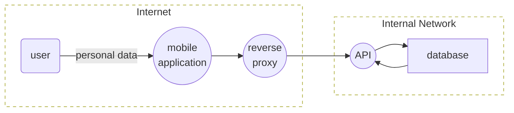
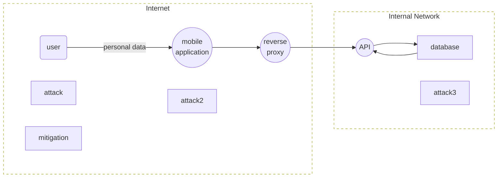

## DFD - Data Flow Diagram
```mmd
flowchart LR
    user(user)
    mobile((mobile\napplication))
    proxy((reverse\nproxy))
    api((API))
    db[|borders:tb|database]

    subgraph external [Internet]
        user--personal data-->mobile
        mobile-->proxy
    end
    subgraph dmz [Internal Network]
        proxy-->api
        db-->api
        api-->db
    end
    classDef boundary fill:none,stroke-dasharray: 5 5
    dmz:::boundary
    external:::boundary
```


## Full Threat Modeling
```mmd
flowchart LR
    subgraph u [" "]
    user(user)
    attack
    mitigation
    end
    subgraph m [" "]
    mobile((mobile\napplication))
    attack2
    end
    subgraph p [" "]
    proxy((reverse\nproxy))
    end
    subgraph a [" "]
    api((API))
    end
    subgraph d[" "]
    db[|borders:tb|database]
    attack3
    end

    subgraph external [Internet]
        u
        m
        p
        user--personal data-->mobile
        mobile-->proxy
    end
    subgraph dmz [Internal Network]
        p
        a
        d
        proxy-->api
        db-->api
        api-->db
    end

    classDef boundary fill:none,stroke-dasharray: 5 5
    classDef entity fill:none,stroke: none
    dmz:::boundary
    external:::boundary
    u:::entity
    m:::entity
    p:::entity
    a:::entity
    d:::entity
```

