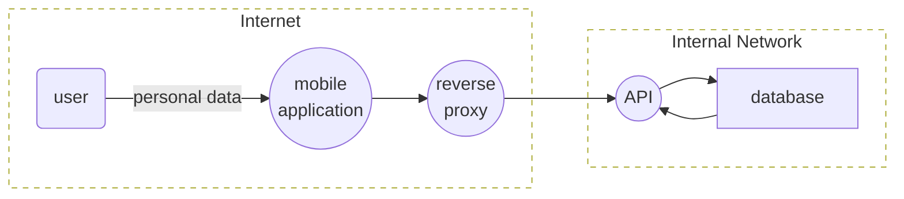

# Testando Mermaid para Threat Modeling

```mermaid
flowchart LR
    user(user)
    mobile((mobile\napplication))
    proxy((reverse\nproxy))
    api((API))
    db[|borders:tb|database]

    subgraph external [Internet]
        user--personal data-->mobile
        mobile-->proxy
    end
    subgraph dmz [Internal Network]
        proxy-->api
        db-->api
        api-->db
    end
    classDef boundary fill:none,stroke-dasharray: 5 5
    dmz:::boundary
    external:::boundary
```
